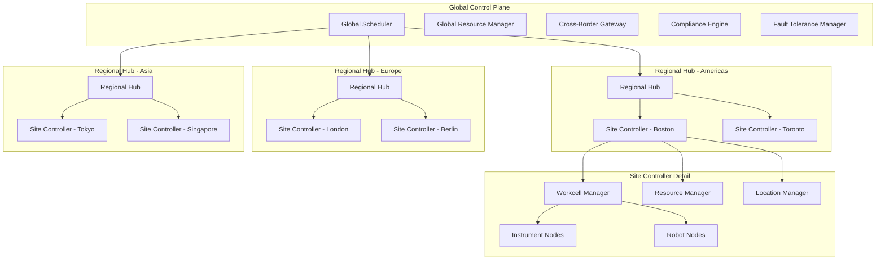

# Design Document: Global Life Sciences Automation Platform

## Overview

The Global Life Sciences Automation Platform extends the existing MADSci framework to operate at global scale, coordinating laboratory instruments and robots across multiple buildings in multiple countries. The platform implements a hierarchical distributed architecture with regional hubs and local site controllers, ensuring both global coordination and local autonomy.

The design leverages the existing Tachyon Node contract for instrument communication while adding new layers for cross-border compliance, global scheduling, and fault tolerance. The system supports both fully automated workflows and hybrid workflows that integrate manual user interactions seamlessly across geographic boundaries.

## Architecture

### High-Level Architecture



### Distributed System Topology

The platform implements a three-tier hierarchy:

1. **Global Control Plane**: Centralized coordination services for cross-site scheduling and compliance
2. **Regional Hubs**: Geographic aggregation points that handle regional coordination and data sovereignty
3. **Site Controllers**: Local MADSci instances managing individual laboratory facilities

This topology provides:
- **Fault Isolation**: Regional failures don't affect other regions
- **Compliance Boundaries**: Data sovereignty enforced at regional level
- **Latency Optimization**: Local operations remain fast, cross-region coordination optimized
- **Scalability**: New sites added to appropriate regional hubs

## Components and Interfaces

### Global Scheduler

The Global Scheduler coordinates multi-site experiments and resource allocation across the entire platform.

**Core Responsibilities:**
- Multi-site workflow orchestration
- Global resource allocation and conflict resolution
- Cross-timezone scheduling coordination
- Priority-based preemption and rescheduling

**Key Interfaces:**
```python
class GlobalScheduler:
    def schedule_multi_site_workflow(
        self, 
        workflow: MultiSiteWorkflow, 
        priority: Priority
    ) -> ScheduleResult
    
    def resolve_resource_conflict(
        self, 
        conflict: ResourceConflict
    ) -> ConflictResolution
    
    def get_global_resource_availability(
        self, 
        resource_type: str, 
        time_window: TimeWindow
    ) -> List[AvailableResource]
```

### Cross-Border Gateway

Handles secure data transfer and compliance validation for international operations.

**Core Responsibilities:**
- Data encryption and secure transfer protocols
- Regulatory compliance validation (GDPR, HIPAA, etc.)
- Data residency enforcement
- Audit trail generation

**Key Interfaces:**
```python
class CrossBorderGateway:
    def transfer_data(
        self, 
        data: ExperimentData, 
        source_region: Region, 
        dest_region: Region
    ) -> TransferResult
    
    def validate_compliance(
        self, 
        operation: DataOperation, 
        regulations: List[Regulation]
    ) -> ComplianceResult
    
    def generate_audit_trail(
        self, 
        operation: DataOperation
    ) -> AuditRecord
```

### Site Controller

Extended MADSci instance with global platform integration capabilities.

**Core Responsibilities:**
- Local laboratory management using existing MADSci components
- Global platform state synchronization
- Autonomous operation during network partitions
- Manual user interaction coordination

**Key Interfaces:**
```python
class SiteController:
    def sync_with_global_platform(self) -> SyncResult
    
    def handle_network_partition(self) -> PartitionStrategy
    
    def coordinate_manual_interaction(
        self, 
        interaction: ManualInteraction
    ) -> InteractionResult
    
    def execute_local_workflow(
        self, 
        workflow: Workflow
    ) -> ExecutionResult
```

### Manual Interface System

Provides seamless integration of manual user interactions with automated workflows.

**Core Responsibilities:**
- User notification and task assignment
- Data validation and integration
- Mobile and web interface provision
- Workflow pause/resume coordination

**Key Interfaces:**
```python
class ManualInterfaceSystem:
    def notify_user_intervention_required(
        self, 
        task: ManualTask, 
        user: User
    ) -> NotificationResult
    
    def validate_manual_data_input(
        self, 
        data: UserInput, 
        validation_schema: Schema
    ) -> ValidationResult
    
    def integrate_manual_data(
        self, 
        manual_data: UserData, 
        workflow_context: WorkflowContext
    ) -> IntegrationResult
```

## Data Models

### Multi-Site Workflow

```python
@dataclass
class MultiSiteWorkflow:
    workflow_id: str
    name: str
    sites: List[SiteRequirement]
    dependencies: List[SiteDependency]
    compliance_requirements: List[ComplianceRequirement]
    manual_steps: List[ManualStep]
    priority: Priority
    estimated_duration: timedelta
    
@dataclass
class SiteRequirement:
    site_id: str
    required_capabilities: List[str]
    resource_requirements: List[ResourceRequirement]
    data_residency_constraints: List[str]
    
@dataclass
class ManualStep:
    step_id: str
    description: str
    required_user_role: str
    data_collection_schema: Schema
    timeout: Optional[timedelta]
```

### Global Resource Pool

```python
@dataclass
class GlobalResource:
    resource_id: str
    site_id: str
    resource_type: str
    capabilities: List[str]
    availability_schedule: Schedule
    compliance_tags: List[str]
    last_sync_timestamp: datetime
    
@dataclass
class ResourceConflict:
    conflict_id: str
    conflicting_workflows: List[str]
    resource_id: str
    time_window: TimeWindow
    resolution_strategy: ConflictResolutionStrategy
```

### Compliance and Audit

```python
@dataclass
class ComplianceRequirement:
    regulation_type: str  # GDPR, HIPAA, 21CFR11, etc.
    data_classification: str
    retention_period: timedelta
    encryption_requirements: List[str]
    audit_requirements: List[str]
    
@dataclass
class AuditRecord:
    record_id: str
    timestamp: datetime
    operation_type: str
    user_id: str
    site_id: str
    data_classification: str
    compliance_validations: List[ComplianceValidation]
```

### Network Partition State

```python
@dataclass
class PartitionState:
    site_id: str
    partition_start_time: datetime
    cached_global_state: GlobalState
    pending_sync_operations: List[SyncOperation]
    autonomous_decisions: List[AutonomousDecision]
    
@dataclass
class SyncOperation:
    operation_id: str
    operation_type: str
    timestamp: datetime
    data_payload: Dict[str, Any]
    conflict_resolution_strategy: str
```

Now I need to use the prework tool to analyze the acceptance criteria before writing the correctness properties section.

<function_calls>
<invoke name="prework">
<parameter name="featureName">global-lab-automation-platform

## Correctness Properties

*A property is a characteristic or behavior that should hold true across all valid executions of a system—essentially, a formal statement about what the system should do. Properties serve as the bridge between human-readable specifications and machine-verifiable correctness guarantees.*

### Property 1: Multi-Site Coordination Consistency
*For any* multi-site experiment, when initiated across multiple sites, all required sites should receive coordination messages and begin execution within the specified timeframe, maintaining synchronized state throughout the experiment lifecycle.
**Validates: Requirements 1.1**

### Property 2: Cross-Border Compliance Enforcement
*For any* data transfer crossing international borders, the system should apply appropriate encryption (AES-256) and validate compliance with destination country regulations before allowing the transfer.
**Validates: Requirements 1.2, 4.1**

### Property 3: Scheduling Conflict Resolution Consistency
*For any* scheduling conflict between sites, the resolution should follow the configured priority rules consistently, ensuring deterministic outcomes for identical conflict scenarios.
**Validates: Requirements 1.3, 3.5**

### Property 4: Automatic Failover and Rescheduling
*For any* site failure, affected workflows should be automatically rescheduled to alternative sites with compatible capabilities within the specified timeframe.
**Validates: Requirements 1.4**

### Property 5: Time Zone Coordination Accuracy
*For any* scheduling operation across different time zones, the system should maintain UTC consistency while providing accurate local time zone conversions for all participating sites.
**Validates: Requirements 1.5**

### Property 6: Eventual Consistency Guarantee
*For any* state change in the global platform, all sites should converge to the same state within 30 seconds under normal network conditions.
**Validates: Requirements 2.1**

### Property 7: Partition Tolerance and Recovery
*For any* network partition event, affected sites should continue autonomous operation using cached state, and upon connectivity restoration, should synchronize changes and resolve conflicts automatically without data loss.
**Validates: Requirements 2.2, 2.3**

### Property 8: Failure Detection and Response
*For any* site controller failure, the global platform should detect the failure within 60 seconds and initiate appropriate failover procedures.
**Validates: Requirements 2.4**

### Property 9: Horizontal Scaling Transparency
*For any* new site addition to the platform, existing operations should continue uninterrupted while the new site integrates within the specified timeframe.
**Validates: Requirements 2.5, 5.2**

### Property 10: Load Distribution Effectiveness
*For any* system load exceeding capacity, workload should be automatically distributed across available sites to maintain performance within acceptable thresholds.
**Validates: Requirements 2.6**

### Property 11: Resource Availability Propagation
*For any* instrument availability change, the global resource pool should be updated within 5 seconds, ensuring accurate resource scheduling across all sites.
**Validates: Requirements 3.1**

### Property 12: Cross-Site Dependency Optimization
*For any* workflow with dependencies spanning multiple sites, execution timing should be coordinated to minimize idle time while maintaining dependency constraints.
**Validates: Requirements 3.2**

### Property 13: Priority-Based Preemption with Data Integrity
*For any* urgent experiment submission during lower-priority workflow execution, preemption should occur while preserving data integrity of the interrupted workflow.
**Validates: Requirements 3.3**

### Property 14: Response Time Guarantees
*For any* operation type (local or cross-site), response times should meet the specified thresholds: sub-second for local operations, sub-5-second for cross-site operations.
**Validates: Requirements 3.4**

### Property 15: Authentication and Authorization Enforcement
*For any* access attempt to restricted data, the system should enforce multi-factor authentication and role-based access control before granting access.
**Validates: Requirements 4.2**

### Property 16: Immutable Audit Trail Generation
*For any* operation requiring audit trails, immutable logs should be created with complete traceability information for compliance verification.
**Validates: Requirements 4.3**

### Property 17: GDPR Compliance Implementation
*For any* GDPR-applicable scenario, the system should enforce data residency requirements and provide right-to-deletion capabilities as mandated by regulation.
**Validates: Requirements 4.4**

### Property 18: Security Incident Response
*For any* detected security incident, affected systems should be automatically isolated and security teams notified within 60 seconds.
**Validates: Requirements 4.5**

### Property 19: Storage Scaling Automation
*For any* storage growth scenario, the system should automatically scale data storage across multiple regions to meet capacity requirements.
**Validates: Requirements 5.5**

### Property 20: Integration Compatibility Preservation
*For any* existing MADSci node or legacy instrument integration, the system should maintain backward compatibility with current protocols (Tachyon Node contracts, SILA, OPC-UA, REST) while providing global platform capabilities.
**Validates: Requirements 6.1, 6.2**

### Property 21: Automatic Firmware Update Detection
*For any* instrument firmware update, the system should automatically detect changes and update node definitions without manual intervention.
**Validates: Requirements 6.3**

### Property 22: Hot-Swap Support Without Disruption
*For any* instrument hot-swap operation during ongoing experiments, the operation should complete without disrupting the experiments or causing data loss.
**Validates: Requirements 6.4**

### Property 23: Global Calibration Coordination
*For any* calibration requirement, the system should coordinate calibration schedules across similar instruments globally to optimize resource utilization and minimize downtime.
**Validates: Requirements 6.5**

### Property 24: Comprehensive Monitoring and Alerting
*For any* system state change, anomaly detection, or performance threshold exceedance, the monitoring system should provide real-time dashboard updates, generate appropriate alerts with severity levels, and maintain detailed metrics for analysis.
**Validates: Requirements 7.1, 7.2, 7.3, 7.4**

### Property 25: Distributed Tracing Completeness
*For any* operation spanning multiple sites and components, complete distributed tracing information should be available for troubleshooting and performance analysis.
**Validates: Requirements 7.5**

### Property 26: Data Replication Timeliness
*For any* experimental data generation, replication to designated backup sites should complete within 15 minutes to ensure data durability.
**Validates: Requirements 8.1**

### Property 27: Federated Search Completeness
*For any* global dataset query, results should include data from all accessible sites while respecting data sovereignty constraints.
**Validates: Requirements 8.2**

### Property 28: Data Sovereignty Enforcement
*For any* data access request, restrictions should be applied based on user location and clearance level according to applicable sovereignty rules.
**Validates: Requirements 8.3**

### Property 29: Data Lineage Preservation
*For any* data operation across sites and transformations, complete lineage and provenance information should be maintained for traceability.
**Validates: Requirements 8.4**

### Property 30: Data Synchronization Conflict Resolution
*For any* data conflict during synchronization, resolution should follow the configured strategy (timestamp-based or user-defined) consistently.
**Validates: Requirements 8.5**

### Property 31: Disaster Recovery Failover
*For any* primary site failure or multi-site disaster scenario, critical experiments should failover to backup sites within specified timeframes while maintaining operational continuity.
**Validates: Requirements 9.1, 9.2**

### Property 32: Manual Workflow Integration
*For any* manual intervention requirement, the system should pause automated workflows, notify designated users with clear instructions, capture and validate user inputs, integrate manual data with automated results while maintaining traceability, and resume automated execution upon completion.
**Validates: Requirements 10.1, 10.2, 10.3, 10.5**

### Property 33: Cross-Platform Manual Interface Access
*For any* user location and device type, mobile and web interfaces should provide consistent functionality for instrument interaction and data input.
**Validates: Requirements 10.4**

### Property 34: Decision Support and Workflow Branching
*For any* decision point requiring user expertise, the system should present relevant data and accept user decisions to guide workflow branching correctly.
**Validates: Requirements 10.6**

### Property 35: Deployment Strategy Consistency
*For any* system update deployment, blue-green deployment strategies should be used to minimize downtime while maintaining system-wide compatibility across all sites.
**Validates: Requirements 11.1, 11.4**

### Property 36: Configuration Management Reliability
*For any* configuration change, validation should occur against all affected sites before deployment, with version control and automatic rollback capabilities upon validation failure.
**Validates: Requirements 11.2, 11.3, 11.5**

## Error Handling

### Network Partition Handling

The platform implements sophisticated partition tolerance using the following strategies:

1. **Cached State Management**: Each site maintains a local cache of global state with configurable TTL
2. **Autonomous Decision Making**: Sites can make local decisions during partitions using cached policies
3. **Conflict Resolution**: Upon reconnection, vector clocks and operational transforms resolve conflicts
4. **Graceful Degradation**: Non-critical global operations are deferred during partitions

### Cross-Border Compliance Failures

When compliance validation fails:

1. **Immediate Blocking**: Data transfer is immediately blocked and logged
2. **Alternative Routing**: System attempts to find compliant alternative paths
3. **Escalation**: Compliance officers are notified for manual review
4. **Audit Trail**: All compliance failures are recorded in immutable audit logs

### Site Failure Recovery

The platform handles various failure scenarios:

1. **Graceful Shutdown**: Sites can signal planned maintenance to enable graceful workflow migration
2. **Crash Recovery**: Automatic detection and failover within 60 seconds
3. **Data Recovery**: Automatic data synchronization upon site restoration
4. **Partial Failures**: Individual component failures are isolated to prevent cascade effects

### Manual Interaction Timeouts

When manual steps exceed configured timeouts:

1. **Escalation Notifications**: Additional users are notified based on escalation policies
2. **Workflow Suspension**: Workflows are suspended with state preservation
3. **Alternative Paths**: System suggests alternative manual steps or automation options
4. **Data Preservation**: All collected data is preserved regardless of timeout outcomes

## Testing Strategy

### Dual Testing Approach

The testing strategy employs both unit testing and property-based testing to ensure comprehensive coverage:

**Unit Tests** focus on:
- Specific examples of cross-border compliance scenarios
- Edge cases in network partition handling
- Integration points between global and local components
- Error conditions and recovery procedures
- Manual interaction workflows with specific user roles

**Property-Based Tests** focus on:
- Universal properties that hold across all valid inputs
- Comprehensive input coverage through randomization
- Timing guarantees under various network conditions
- Consistency properties across distributed components
- Fault tolerance across different failure scenarios

### Property-Based Testing Configuration

All property-based tests will be implemented using **Hypothesis** (Python) with the following configuration:
- **Minimum 100 iterations** per property test to ensure statistical confidence
- **Custom generators** for multi-site workflows, compliance scenarios, and network conditions
- **Shrinking strategies** to find minimal failing examples
- **Timeout handling** for tests involving network operations

Each property test must include a comment tag referencing its design document property:
```python
# Feature: global-lab-automation-platform, Property 1: Multi-Site Coordination Consistency
```

### Integration Testing

Integration tests will verify:
- End-to-end multi-site workflow execution
- Cross-border data transfer with real compliance engines
- Manual interaction integration with actual user interfaces
- Disaster recovery scenarios with simulated site failures
- Performance under realistic load conditions

### Compliance Testing

Specialized compliance testing will include:
- GDPR compliance verification with EU test data
- HIPAA compliance testing with healthcare scenarios
- 21 CFR Part 11 validation for pharmaceutical workflows
- Cross-border data transfer auditing
- Security incident response validation

The testing strategy ensures that both concrete examples and universal properties are validated, providing confidence in the platform's correctness across all operational scenarios.